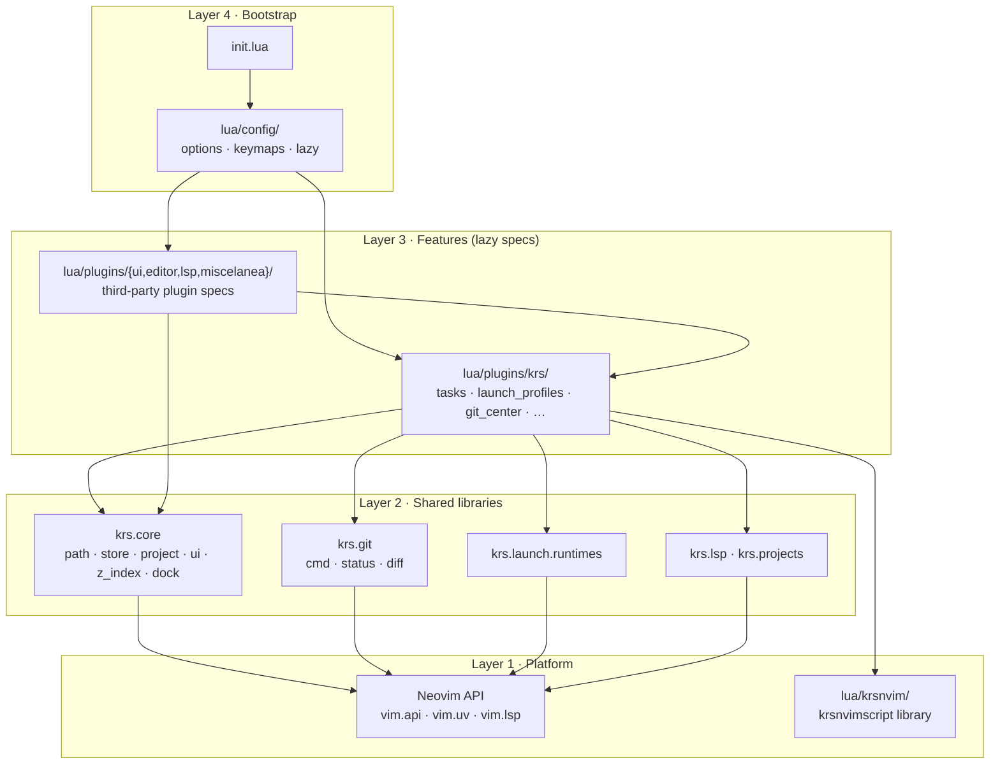
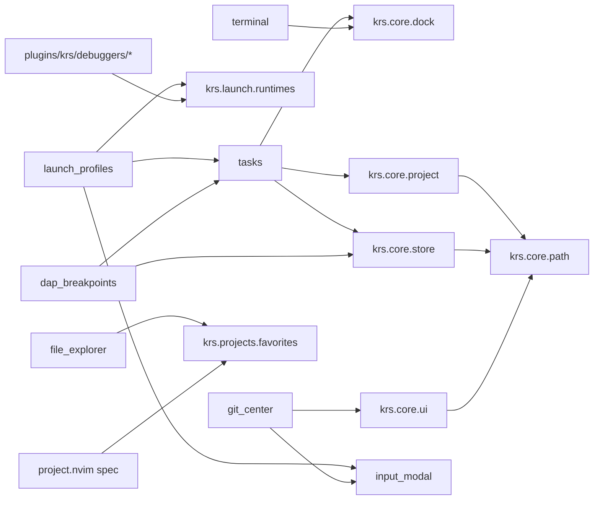
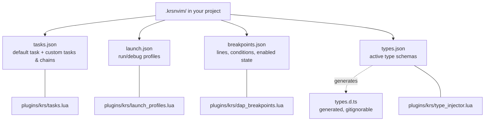
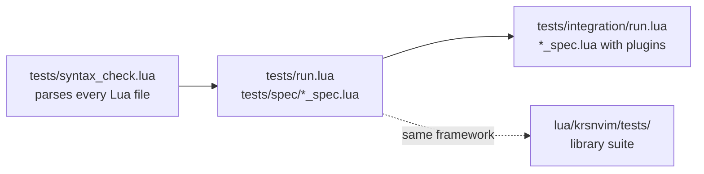

# 🏛️ Architecture

[← Back to Wiki Index](index.md)

How this configuration is put together: the layers, what may depend on what, how
startup runs, and where to add things.

If you only read one section, read [The four layers](#-the-four-layers) and
[Where do I put new code?](#-where-do-i-put-new-code).

---

## 📂 Directory map

```
nvim/
├── init.lua                  Entry point: options → keymaps → lazy
├── lua/
│   ├── config/               Editor bootstrap (no features live here)
│   │   ├── options.lua       Options, filetypes, shell, PATH repair
│   │   ├── lazy.lua          Plugin manager bootstrap and import order
│   │   └── keymaps/          Every keybinding, split by domain
│   │       ├── init.lua      Loads the five modules below
│   │       ├── editor.lua    Text, clipboard, windows, buffers
│   │       ├── search.lua    Find files, splits, URLs
│   │       ├── lsp.lua       Hover, diagnostics, code actions, rename
│   │       ├── debug.lua     DAP keys and the repl toggle
│   │       └── krs.lua       Tasks, launch profiles, git, explorers, scripts
│   │
│   ├── krs/                  Shared internal libraries (pure Lua, testable)
│   │   ├── core/             path, store, project, ui, dock, lazyspec
│   │   ├── git/              cmd, status, diff
│   │   ├── launch/           runtimes (how to run and debug each language)
│   │   ├── lsp/              code_action_menu, editorconfig, dap_repl_source
│   │   └── projects/         favorites
│   │
│   ├── plugins/              One lazy.nvim spec per file
│   │   ├── ui/               Dashboard, bufferline, theme, icons, notifications
│   │   ├── editor/           telescope, neo-tree, dap, neogit, markdown, …
│   │   ├── lsp/              Servers, formatting, treesitter, completion sources
│   │   ├── krs/              This config's own features (each a local spec)
│   │   │   └── debuggers/    Per-language DAP wiring (NOT specs)
│   │   └── miscelanea/       Everything that fits nowhere else
│   │
│   └── krsnvim/              The krsnvimscript automation library (public API)
│       └── tests/            Its own spec suite
│
├── tests/                    Config test suite (see docs/testing.md)
│   ├── run.lua               Headless unit runner
│   ├── syntax_check.lua      Parses every Lua file
│   ├── spec/                 Unit specs (no plugins required)
│   └── integration/          Specs that need the real editor
│
├── colors/                   The nagatoro-krs colorscheme
├── schemas/                  Bundled JSON & TOML schemas
├── schemas-langs/            Type definition bundles for the type injector
└── docs/                     This documentation
```

---

## 🧱 The four layers

Dependencies point **downward only**. Nothing in a lower layer may require
something from a higher one.



**Layer 1 — Platform.** The Neovim API, and `lua/krsnvim/`, which is a
self-contained scripting library with its own public API and test suite. It
knows nothing about this configuration.

**Layer 2 — Shared libraries (`lua/krs/`).** Pure Lua. No keymaps, no autocmds,
no user commands, no global state. Everything here is unit-testable without
starting a plugin, which is exactly why the tests in `tests/spec/` are fast.

**Layer 3 — Features (`lua/plugins/`).** Each file returns a lazy.nvim spec.
This is where UI, keymaps, commands and state live. KRS features may use
third-party plugins (telescope, dap) and each other.

**Layer 4 — Bootstrap (`lua/config/`).** Options, keymaps and the plugin
manager. It wires things together and owns no features of its own.

---

## 🚀 Startup sequence

```mermaid
sequenceDiagram
    participant NV as Neovim
    participant INIT as init.lua
    participant OPT as vim_options
    participant KEY as keymaps
    participant LAZY as lazy_init
    participant SPEC as plugins/*

    NV->>INIT: source init.lua
    INIT->>INIT: vim.loader.enable() (bytecode cache)
    INIT->>OPT: require
    OPT->>OPT: filetypes, options, shell, PATH repair
    INIT->>KEY: require
    KEY->>KEY: editor → search → lsp → debug → krs
    INIT->>LAZY: require
    LAZY->>LAZY: clone lazy.nvim if missing
    LAZY->>SPEC: import ui → editor → lsp → krs → miscelanea
    SPEC-->>NV: eager specs run setup(); lazy ones wait for key/cmd/event
    NV->>NV: VimEnter (breakpoint keys, dashboard)
```

Two ordering rules matter:

1. **Keymaps load before plugins.** A key therefore works even before the plugin
   behind it has loaded — the handler `require`s the module on first press, and
   lazy.nvim loads it then.
2. **`plugins.krs` is imported after `editor` and `lsp`.** KRS features assume
   telescope and nvim-dap exist as specs.

### ⚡ Startup Performance & `lazy_require`

To achieve ultra-fast startup times (~260ms total startup time on Windows), KrsVim enforces lazy module resolution during `lazy.nvim` spec discovery:

* **Top-Level Spec Import Deferral (`lazy_require`)**: Spec files in `lua/plugins/krs/` and `lua/plugins/editor/` use `require("krs.core.lazy_require")("krs.module.name")`. This creates a zero-overhead metatable proxy that defers actual module loading until a property or function is accessed at runtime.
* **Lazy Persistence State**: State reads from disk (such as Neo-tree sidebar width or terminal split height) are wrapped in lazy getters (`get_saved_width()`, `get_terminal_height()`) so no file I/O blocks initial editor startup.
* **Optimized PATH Repair**: Candidate toolchain directories in `lua/config/options.lua` are checked and appended efficiently without blocking `init.lua`.

---

## 🧩 The local plugin spec pattern

Every file directly inside `lua/plugins/krs/` is BOTH a module and a lazy.nvim
spec:

```lua
local M = {}

M.settings = { ... }        -- everything tunable, at the top of the file
function M.setup() ... end  -- commands, keymaps, autocmds

return setmetatable({
  name = "krs_tasks",
  dir = require("krs.core.lazyspec").for_module(),
  lazy = false,
  config = M.setup,
}, { __index = M })
```

`setmetatable` makes both worlds work at once: lazy.nvim sees a spec table,
while `require("plugins.krs.dev.tasks").run_task_item(...)` still reaches the
module's own functions through `__index`.

Two rules come out of this:

* **`M.settings`, never `M.config` or `M.opts`.** `config` and `opts` are lazy
  spec fields; a module table using those names would shadow them.
* **Only top-level files are specs.** lazy.nvim does not descend into
  subdirectories, which is what makes `plugins/krs/debuggers/` a safe place for
  helper modules. Everything else that is not a spec belongs in `lua/krs/`.

See [module-architecture.md](module-architecture.md) for why each spec needs its
own `dir`.

---

## 🔗 Who depends on whom



Highlights worth knowing:

* **`tasks` is the execution engine.** Launch profiles, the dev-server bridge and
  the `.krsnvim` runner all end up calling `tasks.run_custom_command`.
* **`krs.launch.runtimes` is the language table.** Both "run in a terminal" and
  "debug with DAP" read from it, so adding a language is one entry.
* **`krs.core.dock` owns the bottom strip.** The multi-terminal (left) and task
  outputs (right) share it; neither manages the layout alone any more.
* **Favorites are shared.** Starring a folder in the explorer pins the project in
  the recent-projects picker, because both read `krs.projects.favorites`.

---

## 💾 Per-project state

Everything project-specific lives in the project itself, under `.krsnvim/`.
Nothing is stored globally except caches and recent lists.



All four go through `krs.core.project.config_path(name, root)`, which resolves
`.krsnvim/` first, then the legacy `.krslocal/` and `.nvimkrs/` locations, and
through `krs.core.store`, whose reads never throw: a corrupt file degrades to a
default instead of breaking startup.

Global state (caches, not settings) lives under `stdpath("data")`:
`project_favorites.json`, `wsl_recent_projects.json`, `command_palette_history.json`, `workspaces/index.json`,
`krs-specs/` (the empty marker directories), `krs-bun-dap/`.

---

## 🧭 Where do I put new code?

| I want to… | Put it in | Notes |
| :--- | :--- | :--- |
| Add a keybinding | `lua/config/keymaps/<domain>.lua` | Unless it belongs to a lazy-loaded plugin — then use that spec's `keys`. |
| Add a third-party plugin | `lua/plugins/<area>/<name>.lua` | Return a lazy spec. Nothing else to register. |
| Add a KRS feature | `lua/plugins/krs/<name>.lua` | Follow the local spec pattern above. |
| Add a helper used by two features | `lua/krs/<area>/<name>.lua` | Must stay pure: no keymaps, no commands. |
| Add a language to run/debug | `lua/krs/launch/runtimes.lua` + `lua/plugins/krs/debuggers/` | See [adding-language.md](adding-language.md). |
| Add an editor option | `lua/config/options.lua` | The `settings` table at the top. |
| Change a feature's behaviour | That module's `M.settings` block | Always the first thing in the file. |
| Add a test | `tests/spec/` or `tests/integration/` | See [testing.md](testing.md). |

---

## 📐 Conventions

Every file in this configuration follows the same shape:

```lua
-- ============================================================================
-- WHAT THIS FILE IS -- one line.
-- ============================================================================
-- WHY IT EXISTS, what it owns, the keys or commands it exposes, and anything
-- surprising a reader would otherwise have to reverse-engineer.
-- ============================================================================

local dependency = require("...")

-- ============================================================================
-- CONFIGURATION -- everything tunable, before any logic
-- ============================================================================
M.settings = { ... }

-- ============================================================================
-- SECTIONS -- grouped by responsibility
-- ============================================================================
--- What the function does, and why when that is not obvious.
--- @param name type Description.
--- @return type Description.
function M.something(name) end
```

Rules that are load-bearing rather than cosmetic:

1. **Configuration first.** If a value could reasonably be changed — a key, a
   size, a path, a colour, a timeout, a list of languages — it belongs in the
   settings block at the top, not buried in a function.
2. **Comments explain WHY.** What the code does is visible; why it is written
   that way is not. Every workaround names the behaviour it works around.
3. **One owner per concern.** Two modules must not both implement path
   normalization, JSON persistence or dock layout; they share one library.
4. **Tabs for indentation**, following `.editorconfig`.
5. **English throughout**, including notifications.

---

## 🧪 Tests



```sh
nvim -l tests/syntax_check.lua                 # nothing is broken
nvim -l tests/run.lua                          # unit specs (fast, no plugins)
nvim --headless -S tests/integration/run.lua   # with the real editor
```

Details, and how to write a spec, in [testing.md](testing.md).
